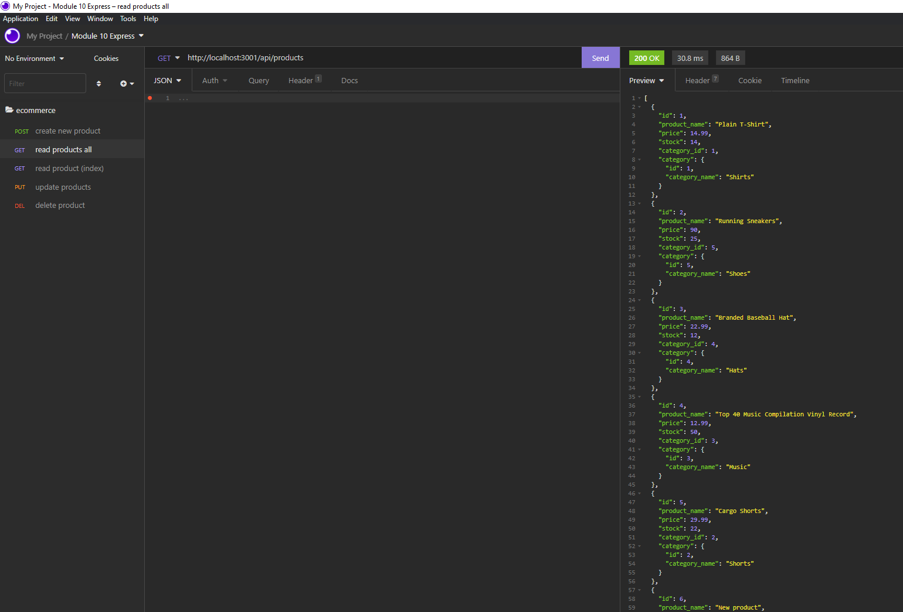

# E Commerce Back End

## Description

An E-Commerce backend, using a working express.js API. COnfigured to use sequelize to interact with the MySQL database.

## Table of Contents

- [Installation](#installation)
- [Usage](#usage)
- [License](#license)
- [Questions](#questions)

## Installation

- To install, click the green code button. Download the zip file and unpack. Open in your favourite code editor.
- Open index.js and open the terminal
- Change mysql database info in .env file
- In the terminal run "npm i"
- Create the database running source schema.sql
- Populate seeds data running npm run seed
- In the termianl run "npm start"

## Usage

[DEMO VIDEO](https://drive.google.com/file/d/1nwKZTsM8wewyo2cN15UDieOpT6EgwRMi/view).

## License

[APACHE](https://www.apache.org/licenses/LICENSE-2.0.txt)

## Questions

[GitHub Profile](https://github.com/bdubz93).

Questions? You can email me at brandonwinkler@live.ca.
